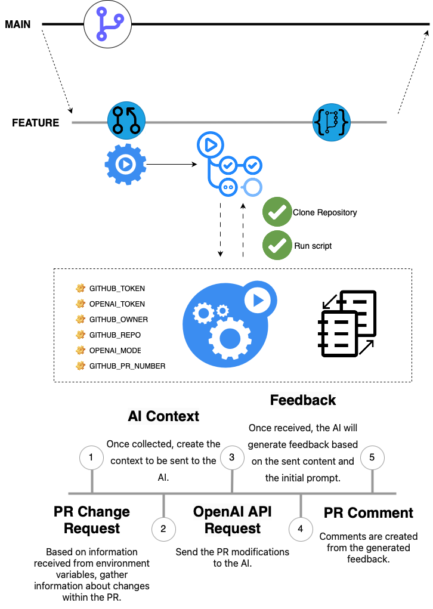

# PRfectionists

The main goal of this project is to provide a solution that adds value to the review of open Pull Requests (PRs). Currently, PR reviews take up a significant amount of time, and the application of artificial intelligence (AI) can enhance the efficiency of this process, as well as suggest improvements that are sometimes overlooked. There are several tools already on the market that fulfill this purpose. However, as I mentioned earlier, our intention is not to compete with enterprise solutions, but rather to develop a feature that allows us to learn and generate valuable insights.

## Setup

The main focus of the solution is to provide feedback on the modifications made within a PR. To use the solution, you must have an OpenAI token. If you do not have a token, you need to obtain one before using the solution.

1) Add the OpenAI token as secrets in your project with the name OPENAI_TOKEN.
2) Create the GitHub Actions configuration file in **.github/workflows** with the following content.

```yml
name: PRfectionists code review

on:
  pull_request_target:
    types: [labeled]

jobs:
  invoke-go-script:
    runs-on: ubuntu-latest
    if: github.event.label.name == 'ai-reviewer'
    steps:
    
    - uses: actions/checkout@v2
      with:
        repository: 'lucasmbaia/power-actions'
        path: 'power-actions'
        ref: 'main'
        fetch-depth: 0
                
    - name: Invoke PR Review
      run: go run main.go review
      working-directory: ./power-actions
      env:
        GITHUB_TOKEN: ${{ secrets.BOT_TOKEN }} # Github bot token
        OPENAI_TOKEN: ${{ secrets.OPENAI_TOKEN }} # Openai Token
        GITHUB_OWNER: ${{ github.repository_owner }} # Name of reporitory's owner
        GITHUB_REPO: ${{ github.repository }} # Name of repository
        OPENAI_MODEL: "gpt-4-1106-preview" # Model to use at OpenAI Chat
        GITHUB_PR_NUMBER: ${{ github.event.pull_request.number }} #Number of PR
```

3) Adjust the OpenAI model to be used if necessary.
4) Push the changes to the repository so that it is possible to use PRfectionists on the next Pull Requests.

## How It Works

When running the solution, a series of steps will be performed to obtain the feedback generated by the AI and provide the feedbacks in the form of comments on the open PR.

1) Once initiated, the first step is to capture all the changes that have been made within the open PR. This will include all changes in all commits made, as well as any previous comments if they exist.
2) Once the process of collecting information from the PR is complete, the next step is to send the content to the AI for analysis and feedback. For this, as a system rule, an initial prompt is sent to the AI to provide guidance on the content to be analyzed and the analysis rules that must be followed.
3) A request is made to the AI with the initial prompt and all content related to the PR.
4) Upon receiving any feedback regarding the changes made, the solution will create comments based on the feedback received, if the AI has generated any feedback.

<div align="center">
  
</div>
